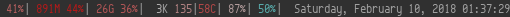
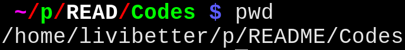

============
Codes in Use
============

.. contents:: **Projects**
   :local:

Daily
=====

dotfiles__
----------

__ https://github.com/livibetter/dotfiles

::

  2010-06-30--present

Before moved to GitHub on 2011-08-13, it was on `Google Code`__.

__ https://github.com/lbarchive/yjl/tree/master/dotfiles

dzen-status_: System status monitor with dzen2
----------------------------------------------

.. _dzen-status: https://github.com/livibetter/dzen-status

::

  C / dzen2
  2010-12-04--present

A C program that polls system resource status and uses dzen2 to display 
the numbers.  It was originally written in Bash (lasted 16 days), but 
ported to C for performance.

e.bash__: ``$ e 1+sin[90*pi/180]  # = 2``
-----------------------------------------

__ https://bitbucket.org/grandpas/e.bash

::

  C / Bash
  2014-08--present (Fork, Maintainer)

It was a fork of Dimitromanolakis Apostolos' e *tiny expression evaluator* in
2001.  I forked it in 2014 to make it a built-in of Bash for performance.

td.sh__: 1 day 30 minutes 12 seconds
------------------------------------

__ https://github.com/livibetter/td.sh

::

  C / Bash
  2010-11-22--present

td prints out time duration or relative time.

Originally, it was written in Bash, ported to C as Bash built-in on 2014-07-06
as a learning project for GNU Build System.

It was on `Google Code`__ until 2012-01-17.

__ https://git.io/vNb71

vimps1_: Colorful Vim-like directory abbreviation for ``$PS1``
--------------------------------------------------------------

.. _vimps1: https://github.com/livibetter/vimps1

::

  C / Bash
  2010-08-31--present

Originally, it was written in Bash inside ``.bashrc``, see HISTORY in its
README.

Other link: `screenshot <https://imgur.com/uQBlfUl>`_

`Shell Is The New Launcher`__
-----------------------------

__ https://github.com/livibetter/ShellIsTheNewLauncher

::

  POSIX Shell
  2016-12-13--present

An idea of using shell as X Window program launcher.

Occasionally
============

nthanniv__: nth-anniversary
---------------------------

__ https://gist.github.com/livibetter/5235605

::

  Python
  2013-03-25--present

Tracking anniversaries and how many days until next.  The following example
output shows that I am 8 years of Gentoo user and 65 days until next
anniversary, I've maintained smartypants for 4 years and 136 days.

::

  $ date +%Y-%m-%d
  2018-02-10
  $ nthanniv
  8  65 2009-04-16 to 2018-02-10 Gentoo User
  6 146 2011-07-06 to 2018-02-10 dwm
  4 136 2013-08-10 to 2017-12-24 smartypants
