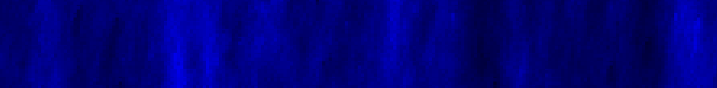
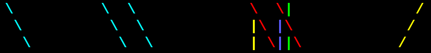
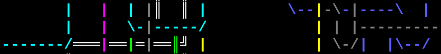
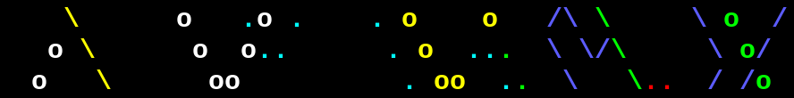
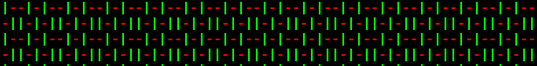
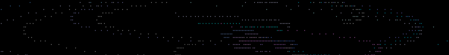
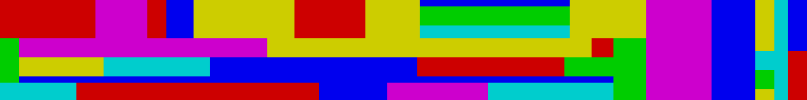

=====================
Terminal Screensavers
=====================

.. contents:: **Projects**
   :local:

Screensavers
============

`Blue Ocean`_: Procedural Blue, Endless Generation
--------------------------------------------------

.. _Blue Ocean: https://github.com/lbgists/blue-ocean

::

  Bash / Linux / 256-color/[24-bit-color] terminal
  2013-10-20--present

It generates an ocean look graphics in terminal, and also has Gray Canyon and
Rainbow.

Other links:
`YouTube <https://www.youtube.com/watch?v=6uM2dv5siqA>`__

glsr.sh_: Go Left, Straight, or Right?
--------------------------------------

.. _glsr.sh: https://github.com/livibetter/glsr.sh

::

  Bash / Linux
  2018-01-27--present

Other links:
`screenshots <https://imgur.com/a/XGvz5>`__
`YouTube <https://www.youtube.com/watch?v=uofkUcIIoS0>`__

pipes.sh_: Animated pipes terminal screensaver
----------------------------------------------

.. _pipes.sh: https://github.com/pipeseroni/pipes.sh

::

  Bash / Linux
  2013-02-01--2015-05-05

I modified the original pipes.sh and put it on Gist, later moved to GitHub, and
created Pipeseroni.

Other links:
`screencast <https://www.youtube.com/edit?o=U&video_id=q_nYfR6CVEY>`__

pipesX.sh_: Animated pipes terminal screensaver at an angle
-----------------------------------------------------------

.. _pipesX.sh: https://github.com/pipeseroni/pipesX.sh

::

  Bash / Linux

With inspiration from pipes.sh, I created this variant of pipes.sh.

Other links:
`screencast <https://www.youtube.com/edit?o=U&video_id=dITTlFPYVPA>`__

weave.sh_: Weaving in terminal
------------------------------

.. _weave.sh: https://github.com/pipeseroni/weave.sh

::

  Bash / Linux
  2013-05-22--2013-07-10

Other links:
`screencast <http://youtu.be/voFiTMweXHs>`__

startrail.c_: Star trail in terminal
------------------------------------

.. _startrail.c: https://bitbucket.org/lbarchive/startrail.c

::

  C / ncurses / Linux
  2015-10-02--2016-02-06

blocky.sh_: colorfully blocky thingy in terminal
------------------------------------------------

.. _blocky.sh: https://bitbucket.org/lbarchive/blocky.sh

::

  Bash
  2015-09-05--2015-09-05
